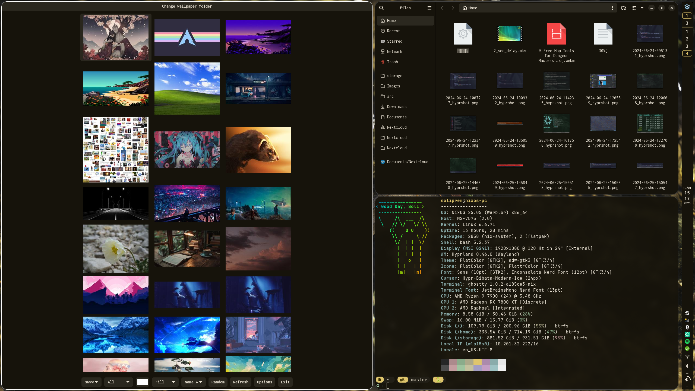
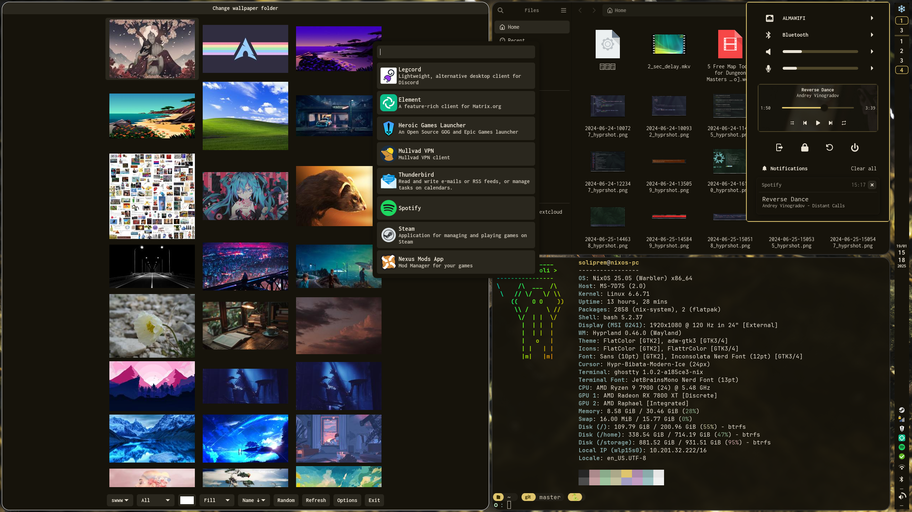
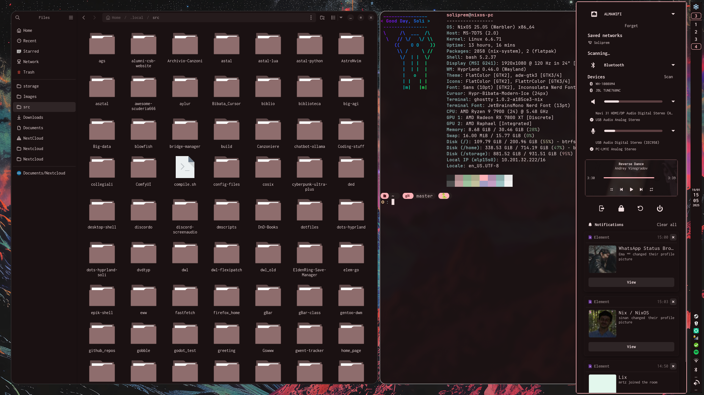
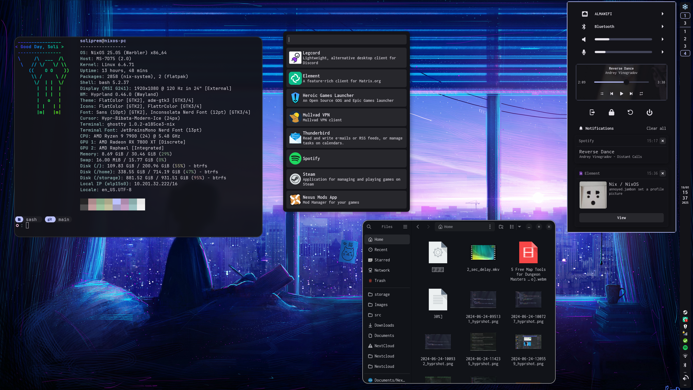

# Soli's Ags Shell

> A sash is a large and usually colorful ribbon or band of material worn around
> the human body, either draping from one shoulder to the opposing hip and back
> up, or else encircling the waist.

This is a vertical bar rice with a system menu (which I plan to expand and whose
elements will eventually be accessible separately, too), an app launcher and
automatic theming. Theming is handled by pulling colors from the adw-gtk3 gtk
theme, which is the default theme the Matugen presets are made for. In other
words, this is designed for systems that use matugen+adw-gtk3 for gtk themes
(though it still needs some tweaking).

It's named sash because Soli's Ags Shell, but it's also a cute garnment, so I'll
take it.

The bars can be toggled off without turning off the rest, and they will sync
correctly on all monitors.

To-do (once exams are over):

- [ ] redesign app launcher
- [ ] Add functionality to the launcher (run launcher, maybe make it into a
      dmenu-style launcher)
- [ ] Add separate icons to toggle submenus directly
- [ ] Add a theming section to pick a wallpaper within ags
- [ ] Add fallback colors in case there's no configured gtk theme on the system
- [ ] TO-DO widget with (hopefully) webDAV sync to pop up from the clock widget
      instead of a pretty useless gtk calendar
- [ ] TBD (now that it's usable I'll just work on this on lost time for fun)

## Credits

Massive thanks to [Aylur](https://github.com/aylur/) for making astal and ags.
Thanks also go to [JohnOberhauser](github.com/JohnOberhauser), whose config I
took a lot of inspiration from.
