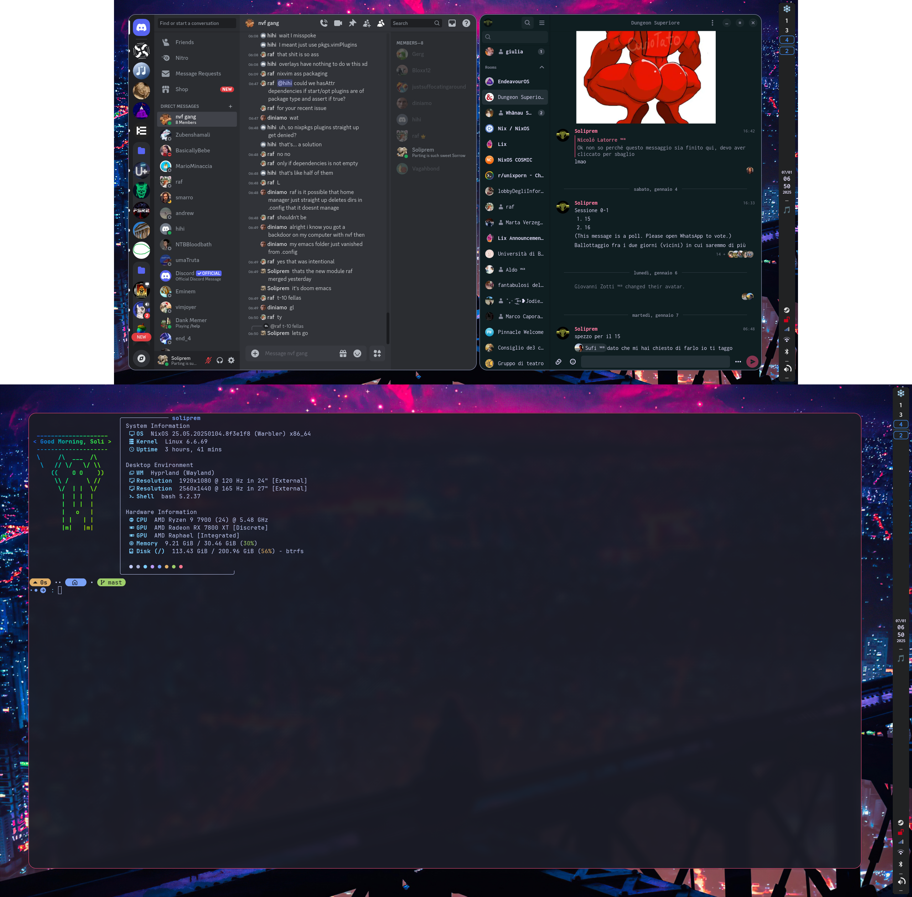
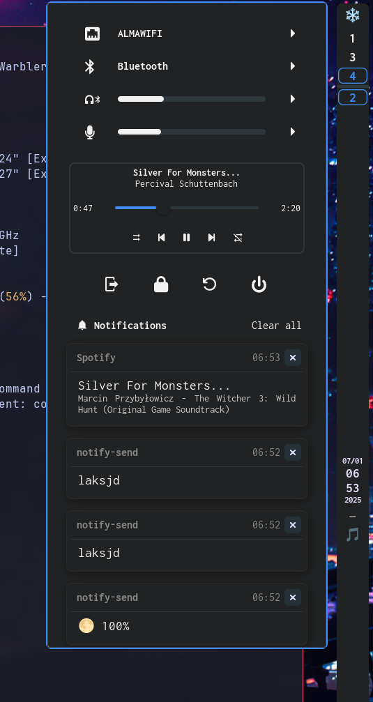

# Soli's Ags Shell

> A sash is a large and usually colorful ribbon or band of material worn around
> the human body, either draping from one shoulder to the opposing hip and back
> up, or else encircling the waist.

## Credits

Massive thanks to [Aylur](https://github.com/aylur/) for making astal and ags.
Thanks also go to [JohnOberhauser](github.com/JohnOberhauser), whose config I
took a lot of inspiration from
